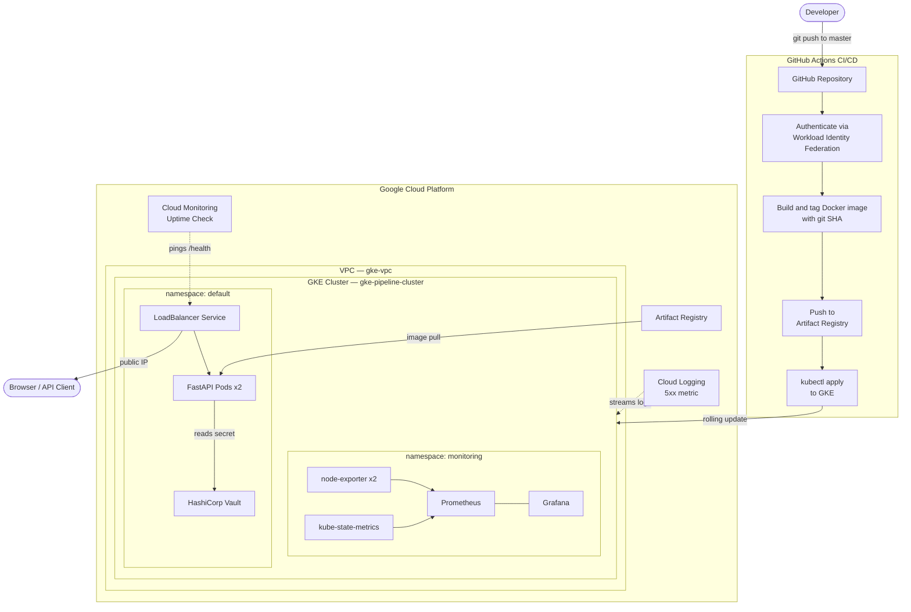

# GCP GKE Pipeline

An end-to-end DevOps pipeline on Google Cloud Platform. A containerized FastAPI service is built and tested through GitHub Actions CI/CD, published to Google Artifact Registry, and deployed to a GKE Kubernetes cluster provisioned entirely with Terraform. Secrets are managed by HashiCorp Vault running inside the cluster, and the full stack is observable through Prometheus, Grafana, and GCP Cloud Monitoring.

---

## Architecture



---

## Stack

| Layer | Technology |
|---|---|
| Infrastructure | Terraform · GCP VPC · GKE · Artifact Registry · IAM |
| Application | Python 3.12 · FastAPI · Uvicorn |
| Containers | Docker · Google Artifact Registry |
| Orchestration | Kubernetes (GKE Standard, zonal) |
| CI/CD | GitHub Actions · Workload Identity Federation |
| Secrets | HashiCorp Vault (Helm, dev mode) |
| Observability | Prometheus · Grafana · AlertManager · GCP Cloud Monitoring |
| IaC | Terraform (Google provider v5) |

---

## Project Structure

```
.
├── app/
│   ├── main.py              # FastAPI application
│   └── requirements.txt
├── k8s/
│   ├── deployment.yaml      # Kubernetes Deployment (2 replicas)
│   ├── service.yaml         # LoadBalancer Service
│   ├── vault/
│   │   └── values.yaml      # Helm values for HashiCorp Vault
│   └── monitoring/
│       └── values.yaml      # Helm values for kube-prometheus-stack
├── terraform/
│   ├── main.tf              # Provider configuration
│   ├── variables.tf         # Input variables
│   ├── network.tf           # VPC + subnet
│   ├── gke.tf               # GKE cluster + node pool
│   ├── iam.tf               # Service accounts + IAM roles
│   ├── artifact_registry.tf # Artifact Registry repository
│   ├── cicd.tf              # Workload Identity Federation + CI/CD SA
│   ├── monitoring.tf        # GCP uptime check + log-based metric
│   └── outputs.tf
├── .github/workflows/
│   └── deploy.yml           # CI/CD pipeline
└── Dockerfile
```

---

## Prerequisites

- GCP account with a project and billing enabled
- Tools: `gcloud` CLI, `terraform` >= 1.5, `kubectl`, `helm`, `docker`
- A GitHub repository with Actions enabled

---

## Setup

### 1. Authenticate

```bash
gcloud auth login
gcloud auth application-default login
gcloud config set project YOUR_PROJECT_ID
gcloud auth application-default set-quota-project YOUR_PROJECT_ID
```

### 2. Enable GCP APIs

```bash
gcloud services enable compute.googleapis.com container.googleapis.com artifactregistry.googleapis.com
```

### 3. Provision infrastructure

```bash
cd terraform
terraform init
terraform apply
```

Provisions: VPC, GKE cluster (2× e2-medium nodes), Artifact Registry repo, least-privilege service accounts, and Workload Identity Federation for GitHub Actions.

### 4. Connect kubectl

```bash
gcloud container clusters get-credentials gke-pipeline-cluster \
  --zone us-central1-a --project YOUR_PROJECT_ID
```

### 5. Build and push the app image

```bash
gcloud auth configure-docker us-central1-docker.pkg.dev
docker build -t us-central1-docker.pkg.dev/YOUR_PROJECT_ID/app-repo/fastapi-app:latest .
docker push us-central1-docker.pkg.dev/YOUR_PROJECT_ID/app-repo/fastapi-app:latest
```

### 6. Deploy the application

```bash
kubectl apply -f k8s/
kubectl get svc fastapi-app-svc   # wait for EXTERNAL-IP
```

### 7. Deploy HashiCorp Vault

```bash
helm repo add hashicorp https://helm.releases.hashicorp.com && helm repo update
helm install vault hashicorp/vault -f k8s/vault/values.yaml -n vault --create-namespace
kubectl exec -n vault vault-0 -- vault kv put secret/app db_password=supersecret
```

### 8. Deploy Prometheus + Grafana

```bash
helm repo add prometheus-community https://prometheus-community.github.io/helm-charts && helm repo update
helm install kube-prometheus-stack prometheus-community/kube-prometheus-stack \
  -f k8s/monitoring/values.yaml -n monitoring --create-namespace
kubectl port-forward svc/kube-prometheus-stack-grafana 3000:80 -n monitoring
# open http://localhost:3000 — admin / admin
```

### 9. Configure GitHub Actions

Add two repository secrets under **Settings → Secrets and variables → Actions**:

| Secret | Value |
|---|---|
| `GCP_WORKLOAD_IDENTITY_PROVIDER` | output of `terraform output workload_identity_provider` |
| `GCP_SERVICE_ACCOUNT` | output of `terraform output cicd_service_account_email` |

Every push to `master` now triggers the full CI/CD pipeline.

---

## API Endpoints

| Endpoint | Description |
|---|---|
| `GET /` | Service info |
| `GET /health` | Health check — used by Kubernetes liveness and readiness probes |
| `GET /items` | Sample data endpoint |
| `GET /secret` | Reads `db_password` live from HashiCorp Vault KV v2 |
| `GET /docs` | Auto-generated Swagger UI (FastAPI built-in) |

---

## CI/CD Pipeline

Every push to `master` triggers the following steps:

1. **Authenticate** — GitHub's OIDC provider issues a short-lived token; GCP Workload Identity Federation exchanges it for a scoped GCP access token. No static credentials stored anywhere.
2. **Build** — Docker image built and tagged with the exact git commit SHA for full traceability and easy rollbacks.
3. **Push** — Image pushed to Artifact Registry under both `:SHA` and `:latest` tags.
4. **Deploy** — `sed` substitutes the SHA into `deployment.yaml`, then `kubectl apply` applies all manifests. Rolling update (`maxSurge: 0, maxUnavailable: 1`) keeps the app live during deployment.
5. **Verify** — `kubectl rollout status` blocks until all pods pass readiness probes, failing the pipeline if any pod doesn't start cleanly.

---

## Secrets Management

Vault runs inside the cluster in dev mode (single pod, in-memory, auto-unsealed). The FastAPI `/secret` endpoint reads from the KV v2 engine at `secret/app` using the `hvac` Python client. Vault is resolved through Kubernetes internal DNS at `vault.vault.svc.cluster.local`.

**Dev mode trade-offs:** No persistence (secrets lost on pod restart), no HA, no TLS. Intentional for a portfolio project — the goal is demonstrating the secret injection pattern, not operating Vault as production infrastructure. A production deployment would use integrated Raft storage, GCP KMS auto-unseal, and Vault Agent for dynamic short-lived token injection.

---

## Observability

| Component | Purpose |
|---|---|
| Prometheus | Scrapes metrics from all cluster components every 15s |
| Grafana | Pre-built dashboards: cluster resources, node metrics, pod status |
| AlertManager | Alert routing (bundled with kube-prometheus-stack) |
| node-exporter | Host-level metrics (CPU, memory, disk, network) per node |
| kube-state-metrics | Kubernetes object state (replica counts, pod phases, etc.) |
| GCP Cloud Monitoring | Uptime check pinging `/health` every 60s |
| GCP Cloud Logging | Log-based metric counting HTTP 5xx errors from FastAPI pods |

---

## Design Decisions

**Workload Identity Federation over JSON keys**
GitHub Actions authenticates via short-lived OIDC tokens instead of a static JSON service account key stored in GitHub Secrets. WIF tokens expire at the end of each job, require no rotation, and cannot be leaked through log exposure. The binding is scoped to this specific GitHub repository — tokens from any other repo are rejected at the GCP level.

**VPC-native networking**
The GKE cluster uses alias IP ranges with dedicated secondary CIDR blocks for pods and services. This enables direct pod-to-pod routing without NAT, is required for Workload Identity at the pod level, and avoids the 250-route limit that affects routes-based GKE clusters at scale.

**Two least-privilege service accounts**
`gke-node-sa` (attached to nodes) holds only four roles: Artifact Registry reader, log writer, metric writer, monitoring viewer. `github-actions-sa` (CI/CD) holds only Artifact Registry writer and GKE developer. The Compute Engine default SA — which has project-level Editor access — is never used. A compromised node or pipeline token has the minimum possible blast radius.

**Rolling update strategy: `maxSurge: 0, maxUnavailable: 1`**
The Kubernetes default (`maxSurge: 1`) creates a new pod before terminating an old one, temporarily requiring capacity for N+1 pods. On a two-node cluster this caused new pods to stay `Pending` indefinitely due to insufficient CPU. Setting `maxSurge: 0` terminates one pod first, freeing its resources before the replacement starts. The app briefly runs at N-1 replicas, which is acceptable for a demo environment.

**Zonal over regional GKE cluster**
A regional cluster runs three control planes across three zones, costing ~$72/month in cluster management fees alone. A zonal cluster is free. For a portfolio project that doesn't require multi-zone availability, zonal is the correct default. The first change in a production context would be to regional.

---

## Cost Estimate

| Resource | Cost |
|---|---|
| GKE cluster management (zonal) | Free |
| 2× e2-medium nodes | ~$50/month |
| 30 GB boot disks × 2 | ~$2.40/month |
| Artifact Registry | <$0.10/month |
| LoadBalancer | ~$18/month while active |
| Cloud Monitoring / Logging | Free (under quota) |
| **Total** | **~$70/month** |

> Run `terraform destroy` when done to avoid unnecessary charges.

---

## Teardown

```bash
helm uninstall kube-prometheus-stack -n monitoring
helm uninstall vault -n vault
cd terraform && terraform destroy
```

---

## Documentation

| Document | Contents |
|---|---|
| [`docs/application.md`](docs/application.md) | API endpoints, example responses, container image details, Kubernetes configuration |
| [`docs/build-journal.md`](docs/build-journal.md) | Phase-by-phase build log — what was built, commands run, and key decisions made |
| [`docs/troubleshooting.md`](docs/troubleshooting.md) | 11 issues with symptoms, root causes, debugging commands, and fixes |
| [`docs/screenshots/`](docs/screenshots/README.md) | Screenshots of the running system — Grafana, Swagger UI, GCP Console, GitHub Actions |

---

## Troubleshooting

A full log of every issue encountered during this build — symptoms, root causes, debugging commands, and fixes — is in [`docs/troubleshooting.md`](docs/troubleshooting.md).

Issues covered:
- gcloud `Permission denied` on credential files (Windows Administrator ownership)
- `gke-gcloud-auth-plugin` missing from kubectl
- Rolling update `Insufficient cpu` due to `maxSurge: 1` default
- `kubectl set image` not applying manifest strategy changes
- Helm `cannot reuse a name that is still in use`
- Terraform log-based metric label descriptor mismatch
- Prometheus/Grafana scheduling failures on e2-small nodes
- Grafana OOMKill and liveness probe startup deadlock
- Node pool upgrade from e2-small to e2-medium via Terraform
